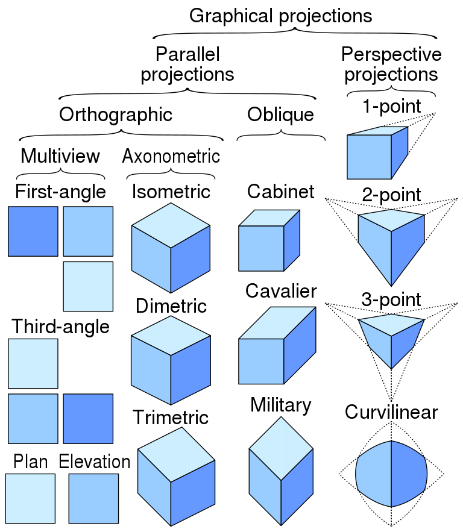

# 3drenderer

## Dependencies

This installs GCC and the C dependencies along with SDL2.

```text
$ sudo apt install build-essential
$ sudo apt install libsdl2-dev
```

## Structure

Sample structure:

```text
3drenderer
├── Makefile
└── src
    ├── main.c
    ├── mesh.c
    └── mesh.h
```

## Compiling

The most simple:

```text
$ gcc main.c -o renderer
$ ./renderer
```

See the `Makefile`.

## Examples

### Scalars

- temperature
- area
- length
- pressure

### Vectors

- velocity
- acceleration
- force
- lift
- drag
- displacement

A cube will be a set of vectors represented by points (originating at 0, 0, 0).

2D vector: (6.0, 3.0) -- two components
3D vector: (3.0, 2.0, 3.0) -- three components

```c
// Creating a new data type for 2D vectors
typedef struct {
    float x;
    float y;
} vec2_t; // _t here is a convention for naming the type

vec2_t p0 = { 0.0, 2.0 };
vec2_t p1 = { 3.0, 2.0 };
vec2_t p2 = { 4.5, -2.2 };

// 3D vector
typedef struct {
    float x;
    float y;
    float z;
} vec3_t;

// etc.
```

Example camera:

```c
typedef struct {
    vec3_t position;
    vec3_t rotation;
    vec3_t fov_angle;
} camera_t;

camera_t mycam = {
    { 0, 0, 0 },
    { 0.3, -2.0, 0.0 },
    0.78
};
```

## Projection

[Two main categories](https://en.wikipedia.org/wiki/3D_projection): _parallel_ and _perspective_.

Some branches of the tree:

- **Parallel** → Orthographic (→ Axonometric → Isometric)
- **Perspective** -- uses a view frustum (the clipped pyramid of vision).



<small>_Graphical projections image used under CC licence from [here](https://en.wikipedia.org/wiki/File:Comparison_of_graphical_projections.svg)_</small>


### Isometric Projection

True isometric projection has 120 degree angles between x, y, and z. Most "isometric" games use 126.87 degrees to make a 2:1 pixel ratio.

### Perspective Divide

Two similar triangles ABC (between eye and 2D viweing plane or screen) and ADE (between eye and 3D object):

```text
BC   AB
-- = --
DE   AD
```

In his diagram, `P'x` is the width of the object on the screen (viewed from above), `Px` is the real width of the 3D object, and `Pz` is the real distance to the 3D object.

```text
P'x   1
--- = --
Px    Pz
```

so, the width of the object on the screen (`P'x`) is the real width of the 3D object (`Px`) over the distance to the 3D object (`Pz`):

```text
      Px
P'x = --
      Pz
```

The farther away the object is, the greater the denominator and the smaller `P'x` will be.

It's the same calculation for y:

```text
P'y   1
--- = --
Py    Pz
```
```text
      Py
P'y = --
      Pz
```
